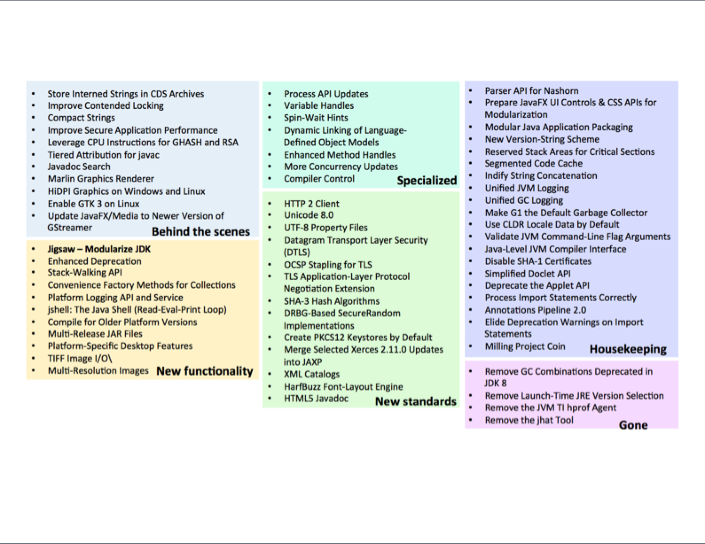

[data-background-color="#ff0000"]
= Java 9 Features

include::../_shared/header.adoc[]

include::../_shared/highlight.js.adoc[]

== Features by Categories

[NOTE.speaker]
--
Despite there are many features present in JDK 9, we will only see few features which might be frequently use in Java 9. We can categorize like...
--

== Notable Categories
* Tooling
* API Enhancements
* Important Under the hood Changes
* New Standards

[transition=zoom, %notitle]
== Tooling

=== Important New Tools
* jshell
* jdeps
* jLink
* jmod
* jdeprscan

=== Tool Enhancements
* javac
* java
* jar
* javadoc

=== jlink

=== jshell
REPL - Read, Evaluate, Print and Loop
----
> ~ jshell
|  Welcome to JShell -- Version 9-ea
|  For an introduction type: /help intro

jshell> 3 + 4 * 7
$1 ==> 31

jshell> int add(int a, int b) {
...>   return a+b;
...> }
|  created method add(int,int)

jshell> add(25, $1)
$3 ==> 56
----

=== Java Artifacts
* jmod
* jlink & jimage
* MR jar for Java library release management

== API Enhancements
There are various small changes. Even if we don't leverage JPMS, once we onboard Java 9, we can make use of these small enhancements immediately.

=== Collection Factories
----
/* Comment sections would break ... */
List<Integer> listOfNumbers = List.of(1, 2, 3, 4, 5
                                        /*, null*/);

Set<Integer> setOfNumbers = Set.of(1, 2, 3, 4, 5/*, 1*/);

Map<String, String> mapOfString =
    Map.of("key1", "value1", "key2", "value2");

Map<String, String> moreMapOfString =
    Map.ofEntries(
        Map.entry("key1", "value1"),
        Map.entry("key2", "value2")/*,
        Map.entry("key1", "value3")*/
);
----

=== Stream Enhancements

=== Try with Resource

=== Diamond Operator

=== Reactive Programming Flow API

=== Deprecated Annotation Enhancement

== Important Under the hood Changes

=== Compact String

=== Default GC Collector G1

== New Standards

[%notitle]
=== HTTP API

HTTP API

----
/**
 * The HTTP API functions asynchronously 
 * and synchronously. In
 * asynchronous mode, 
 * work is done in threads (ExecutorService).
 */
public static void main(String[] args) throws Exception {
  HttpClient.getDefault()
    .request(URI.create("https://www.exxcellent.de"))
    .GET()
    .responseAsync() // CompletableFuture :D
    .thenAccept(httpResponse ->
        out.println(httpResponse
        .body(HttpResponse.asString()))
    );
  Thread.sleep(999); // Give worker thread some time.
}
----